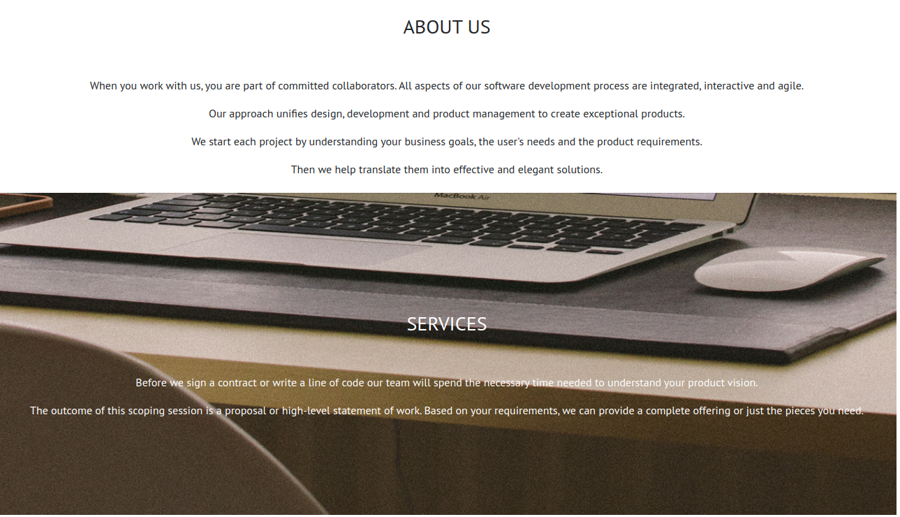
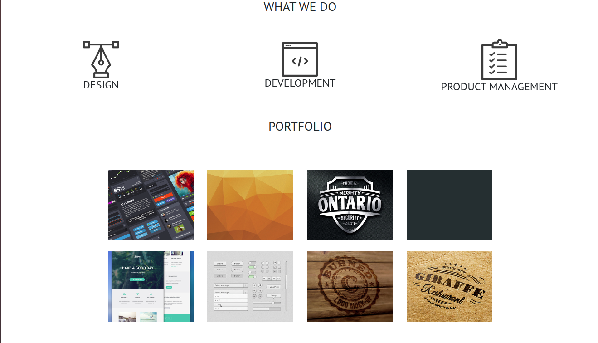
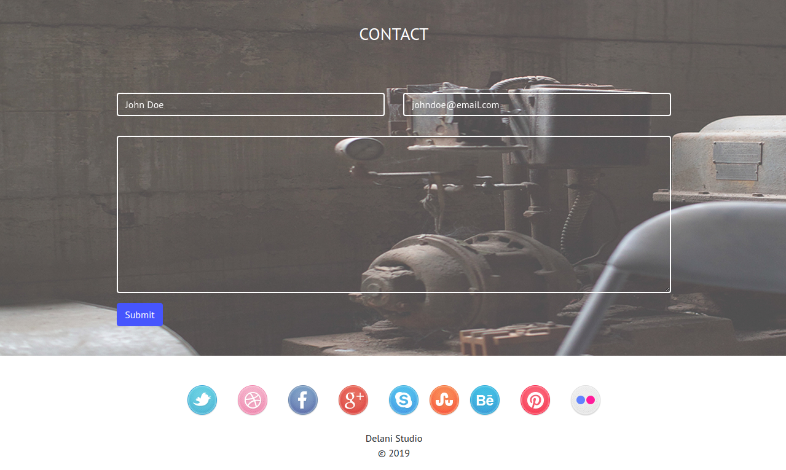

# Delani Studios

This is a landing page of a Design and Development company. It's their official site that prospective clients visit to know more about the company.

## Technologies Used

- HTML & CSS (Bootstrap)
- JavaScript (jQuery 3.4.1)

##### Requirements

A modern web browser.

##### Setup Instructions and Installation

- To view this website online, just visit the live link [here]().
- To use the website online, clone it to a specific location in your computer using `git clone https://github.com/Mantongash/delani-studio.git`. Then move to the root directory of the cloned folder and open `index.html`.

## Known Bugs

On successfully completing the contact form, it should give an alert with a green color, it is currently giving an alert in red color.

##### Link to Live Site : [https://yomzsamora.github.io/Akan-Names/](https://yomzsamora.github.io/Akan-Names/)

### License

_MIT_
Copyright (c) 2019 _Anthony Ng'ang'a_

Permission is hereby granted, free of charge, to any person obtaining a copy of this software and associated documentation files (the "Software"), to deal in the Software without restriction, including without limitation the rights to use, copy, modify, merge, publish, distribute, sublicense, and/or sell copies of the Software, and to permit persons to whom the Software is furnished to do so, subject to the following conditions:

The above copyright notice and this permission notice shall be included in all copies or substantial portions of the Software.

THE SOFTWARE IS PROVIDED "AS IS", WITHOUT WARRANTY OF ANY KIND, EXPRESS OR IMPLIED, INCLUDING BUT NOT LIMITED TO THE WARRANTIES OF MERCHANTABILITY, FITNESS FOR A PARTICULAR PURPOSE AND NONINFRINGEMENT. IN NO EVENT SHALL THE AUTHORS OR COPYRIGHT HOLDERS BE LIABLE FOR ANY CLAIM, DAMAGES OR OTHER LIABILITY, WHETHER IN AN ACTION OF CONTRACT, TORT OR OTHERWISE, ARISING FROM, OUT OF OR IN CONNECTION WITH THE SOFTWARE OR THE USE OR OTHER DEALINGS IN THE SOFTWARE.
